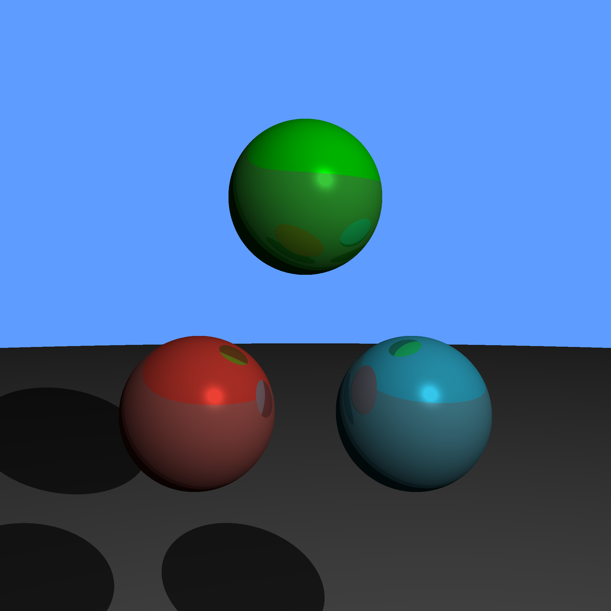

# CUDA-Raytracer
A simple ray tracer written with CUDA that saves its output in a .ppm file, CPU version included for reference. Below, you can find the rendered image and a performance analysis.

This was made as a final project for the GPU programming course at Otto-von-Guericke University Magdeburg.

## The Render
The code currently generates the following image, though it does support more spheres and light sources:

## Performance Analysis
### CPU version (serial vs parallel):
> Note: In the diagrams I used the german spelling of "serial"

%20@%204%20Spheres.png)

%20@%204%20Spheres.png)

### GPU version:

> Direct comparison with the parallel CPU version:

.png)

### CPU vs GPU Direct comparison with more than 4 spheres:
> Note: The time axis is shown on a logarithmic scale

%20@%202048x2048.png)
